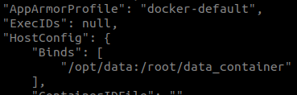
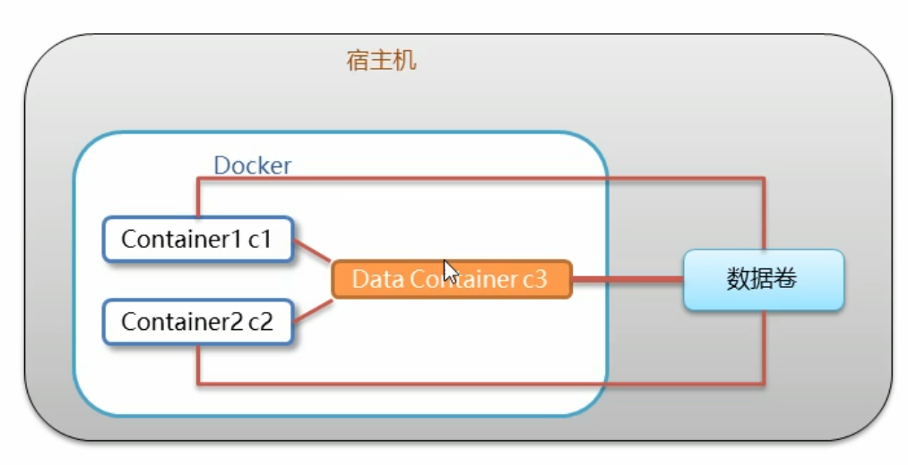

# docker容器的数据卷

## 1.数据卷的概念：

### 数据卷的目的：

- docker容器删除后，容器中的数据任然保留；

- docker容器与外部宿主机进行交互

  **数据卷是宿主机中的一个目录或文件，当容器目录和数据卷目录绑定之后，对方的修改会同步**。

  **一个数据卷可以被多个容器挂载**
  
  **一个容器也可以被挂载多个数据卷**
### 数据卷的作用：

- 保持容器数据的持久化
- 外部机器和容器的间接通信
- 容器之间的数据交换


## 2.配置数据卷

### 1.容器数据卷

**创建启动容器时，使用-v参数设置数据卷**

docker run -it -v /宿主机绝对路径目录:/容器内目录 ........

**example**

```shell
docker run -it --name=c1  -v /opt/data:/root/data_container  mysql:5.7 /bin/bash
```

​	**注意事项：**

1. 目录必须时绝对路径
2. 如果目录不存载，会自动创建
3. 可以挂载多个数据卷


**查看数据卷是否挂载成功。**
使用docker inspect 容器ID，返回的json串有这么一串数据说明挂载成功




## 3.容器间通过数据卷交互

通过数据卷挂载到两个不同的容器上实现容器的数据交互。


## 4.数据卷容器

多个容器进行数据交互：

1. 多个容器挂载同一个数据卷

2. 数据卷容器

   

 **1.创建启动c3数据卷容器，使用-v参数设置数据卷**

```shell
docker run -it --name=c3  -v /volume  ubuntu:18.04 /bin/bash
```

 **2.创建启动c1，c2容器时，使用 --volumes-from [容器别名] 参数设置数据卷**

```shell
docker run -it --name=c1  --volumes-from c3  ubuntu:18.04 /bin/bash

docker run -it --name=c2  --volumes-from c3  ubuntu:18.04 /bin/bash
```

