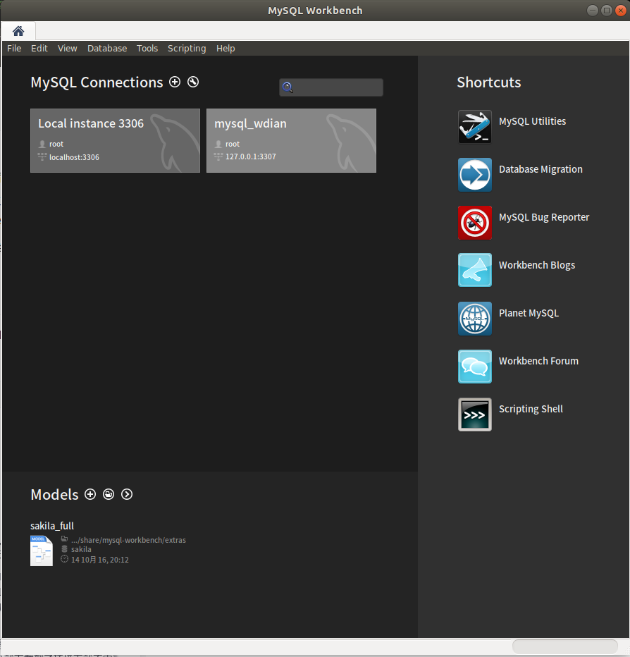
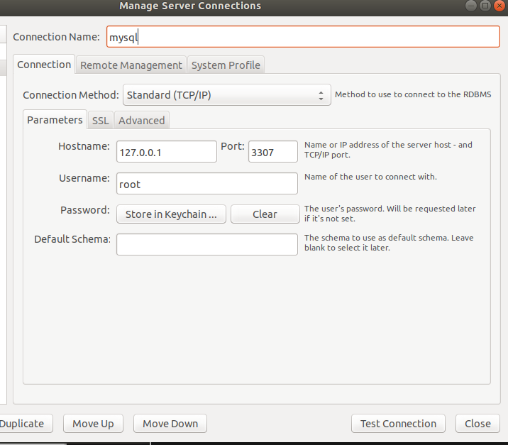

# docker部署mysql

**需求：**在docker容器中部署mysql，并且通过外部mysql client操作mysql server。

**实现步骤：**

1. 搜索mysql镜像；
2. 拉取合适的mysql镜像；
3. 创建容器；
4. 操作容器中的mysql；


## mysql部署

- 容器内的网络服务无法和外部机器进行通信；

- 外部机器可以和宿主机进行通信；

- 宿主机可以和容器进行直接通信；

- 当容器内的网络服务需要被外部机器访问时，可以将容器中提供的服务端口映射到宿主机的端口上，外部机器访问宿主机的该端口，从而间接实现访问容器的服务。

- 这种操作称为：***端口映射***

  


**准备工作**：docker中存在mysql镜像

- 创建目录，用于存储mysql数据信息

```shell
mkdir ~/docker-mysql/
cd  ~/docker-mysql/
```

- 创建容器，设置端口映射、目录映射

```shell
docker run -id \
-p 3307:3306 \
--name=c_mysql \
-v $PWD/conf:/etc/mysql/conf.d \
-v $PWD/logs:/logs \
-v $PWD/data:/var/lib/mysql \
-e MYSQL_ROOT_PASSWORD=123456 \
mysql:5.7
```

**参数说明：**

- **-p 3307:3306**：将容器的3306端口映射到宿主机3307端口（一般会将端口设为一致,此处为了区分）
- **-v $PWD/conf:/etc/mysql/conf.d**：将主机当前目录下的conf/my.cnf挂载到容器的/etc/mysql/conf.d配置
- **-v $PWD/logs:/logs**：将主机当前目录下的logs目录，挂载到容器的logs。日志目录。
- **-v $PWD/data:/var/lib/mysql** ：将主机当前目录下的data目录，挂载到容器的/var/lib/mysql。数据目录。
- **-e MYSQL_ROOT_PASSWORD=123456**：初始化root用户的密码。

## mysql客户端连接

本机是ubuntu18.04系统，客户端用的是Mysql-Workbench:

可用命令行进行安装：

```shell
sudo apt-get install mysql-workbench
```

启动后的界面如下图所示：




点击mysql connections右侧的加号建立新的连接，参数配置与创建的容器保持一致。

